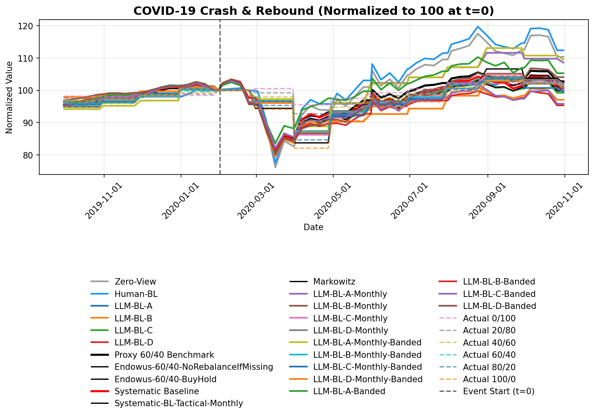
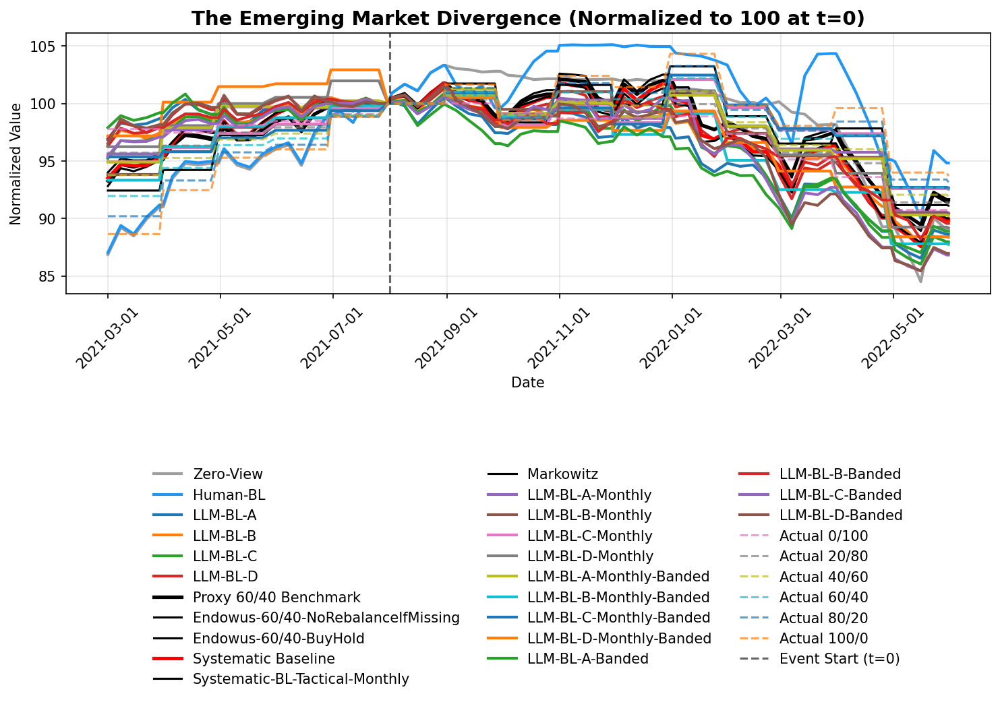
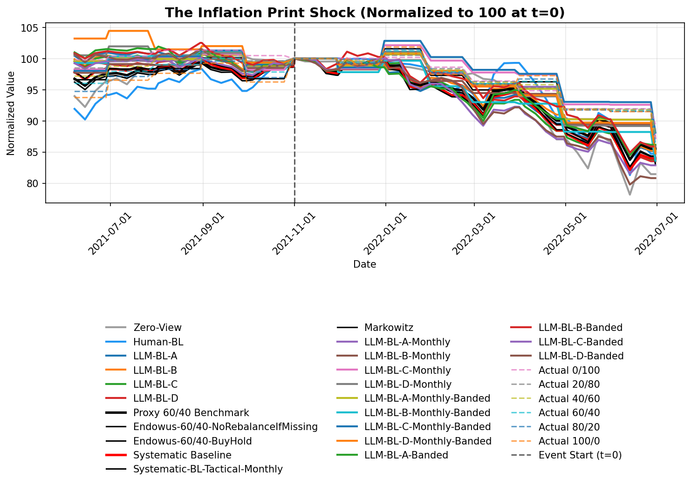
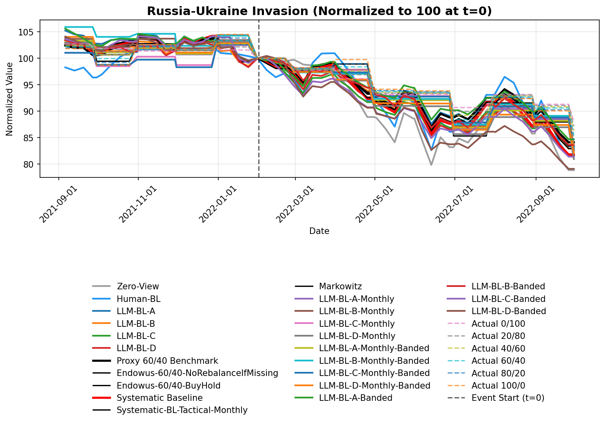
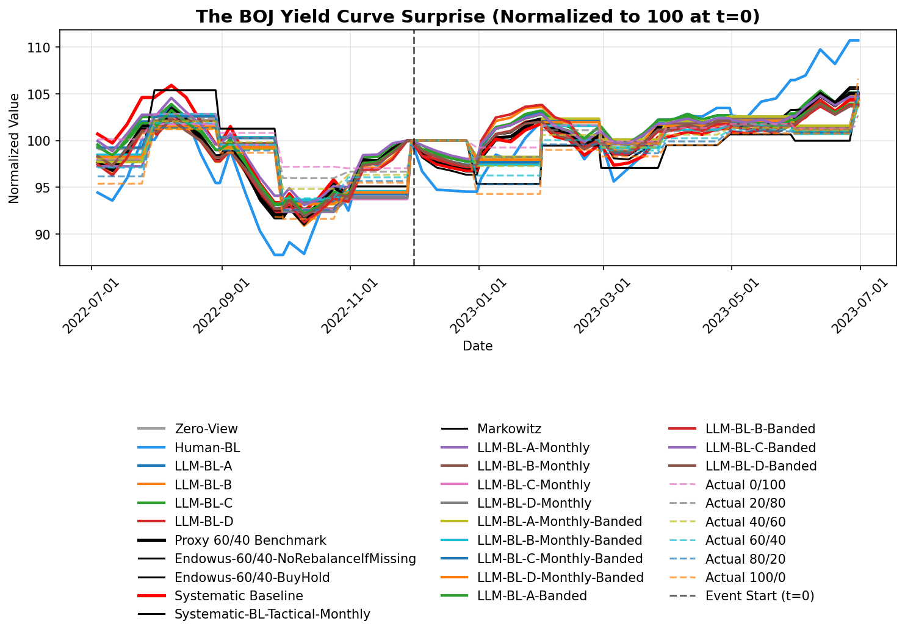
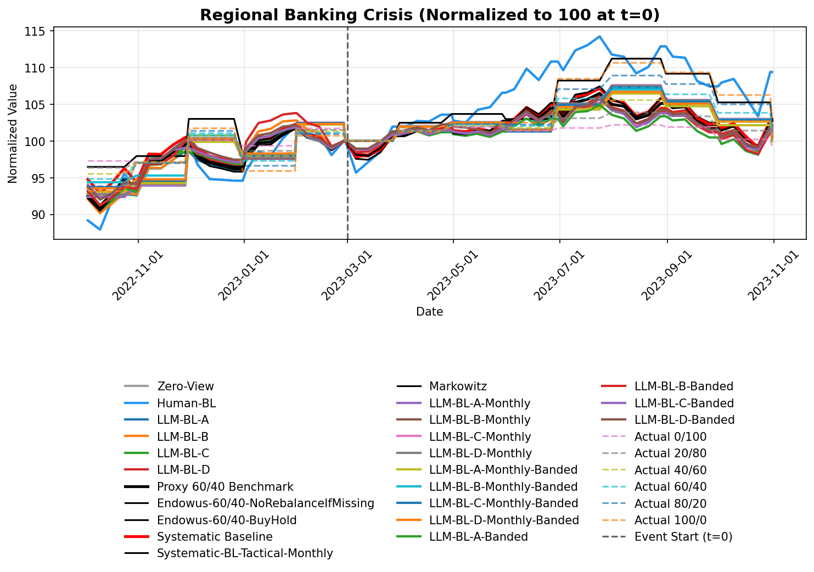

# Stress Testing & Event Studies Report

This report evaluates the performance of the Black-Litterman portfolio variations during specific historical market shocks.

## COVID-19 Crash & Rebound (2020-02-01 to 2020-05-31)

| Strategy                           | Return   |   Sharpe Ratio | Max Drawdown   |   Calmar Ratio | CAPM Alpha (Ann)   | FF3 Alpha (Ann)   | FF5 Alpha (Ann)   |
|:-----------------------------------|:---------|---------------:|:---------------|---------------:|:-------------------|:------------------|:------------------|
| Zero-View                          | 10.32%   |          0.419 | -24.33%        |          0.511 | 8.65%              | 11.64%            | 15.63%            |
| Human-BL                           | 12.36%   |          0.484 | -22.99%        |          0.649 | 11.09%             | 14.33%            | 18.49%            |
| LLM-BL-A                           | 0.43%    |          0.04  | -21.39%        |          0.018 | -5.40%             | -4.90%            | -0.64%            |
| LLM-BL-B                           | -2.95%   |         -0.119 | -22.78%        |         -0.119 | -9.02%             | -8.40%            | -6.27%            |
| LLM-BL-C                           | -0.76%   |          0.032 | -21.80%        |         -0.032 | -6.00%             | -4.44%            | -2.59%            |
| LLM-BL-D                           | 1.58%    |          0.101 | -21.73%        |          0.067 | -4.52%             | -2.92%            | -0.05%            |
| Endowus-60/40                      | 2.74%    |          0.183 | -21.53%        |          0.117 | -2.99%             | -1.22%            | 1.06%             |
| Endowus-60/40-NoRebalanceIfMissing | 2.65%    |          0.179 | -21.53%        |          0.113 | -3.06%             | -1.30%            | 0.96%             |
| Endowus-60/40-BuyHold              | 1.14%    |          0.111 | -22.29%        |          0.047 | -4.58%             | -3.04%            | -0.81%            |
| Systematic-BL                      | 0.67%    |          0.091 | -21.63%        |          0.029 | -5.13%             | -3.82%            | -1.59%            |
| Systematic-BL-Tactical-Monthly     | 2.33%    |          0.191 | -17.30%        |          0.124 | 3.25%              | 4.89%             | 4.20%             |
| Markowitz                          | -0.16%   |          0.067 | -22.19%        |         -0.007 | -5.49%             | -4.72%            | -2.70%            |
| LLM-BL-A-Monthly                   | 8.57%    |          0.436 | -14.33%        |          0.549 | 2.95%              | 4.47%             | 3.83%             |
| LLM-BL-B-Monthly                   | 2.08%    |          0.131 | -14.12%        |          0.136 | 1.49%              | 2.47%             | 2.03%             |
| LLM-BL-C-Monthly                   | 1.41%    |          0.064 | -14.38%        |          0.09  | 1.45%              | 2.41%             | 1.97%             |
| LLM-BL-D-Monthly                   | 2.01%    |          0.114 | -13.49%        |          0.137 | 2.29%              | 3.57%             | 3.02%             |
| LLM-BL-A-Monthly-Banded            | 9.47%    |          0.61  | -11.30%        |          0.768 | 4.24%              | 6.24%             | 5.42%             |
| LLM-BL-B-Monthly-Banded            | 0.66%    |          0.086 | -12.80%        |          0.047 | 0.51%              | 1.13%             | 0.82%             |
| LLM-BL-C-Monthly-Banded            | -0.40%   |         -0.048 | -14.20%        |         -0.026 | 0.36%              | 0.91%             | 0.63%             |
| LLM-BL-D-Monthly-Banded            | 0.75%    |         -0.096 | -13.87%        |          0.05  | 3.43%              | 5.13%             | 4.42%             |
| LLM-BL-A-Banded                    | 5.27%    |          0.257 | -18.41%        |          0.263 | -0.98%             | 1.04%             | 5.38%             |
| LLM-BL-B-Banded                    | -4.67%   |         -0.179 | -21.83%        |         -0.197 | -9.23%             | -7.73%            | -5.49%            |
| LLM-BL-C-Banded                    | -4.19%   |         -0.209 | -20.09%        |         -0.192 | -9.86%             | -9.56%            | -8.41%            |
| LLM-BL-D-Banded                    | 4.05%    |          0.175 | -22.25%        |          0.167 | -2.63%             | -0.25%            | 2.05%             |
| Endowus_Actual_0/100               | 2.10%    |         -0.152 | -4.98%         |          0.388 | -1.17%             | -1.18%            | -1.26%            |
| Endowus_Actual_20/80               | 1.78%    |         -0.058 | -7.26%         |          0.225 | -0.10%             | 0.28%             | 0.06%             |
| Endowus_Actual_40/60               | 1.37%    |          0.002 | -9.83%         |          0.128 | 0.84%              | 1.58%             | 1.22%             |
| Endowus_Actual_60/40               | 0.99%    |          0.041 | -12.63%        |          0.072 | 1.92%              | 3.06%             | 2.56%             |
| Endowus_Actual_80/20               | 0.61%    |          0.072 | -15.64%        |          0.036 | 2.95%              | 4.47%             | 3.83%             |
| Endowus_Actual_100/0               | 0.24%    |          0.105 | -18.40%        |          0.012 | 3.93%              | 5.81%             | 5.03%             |

---

## The Emerging Market Divergence (2021-08-01 to 2021-12-31)

| Strategy                           | Return   |   Sharpe Ratio | Max Drawdown   |   Calmar Ratio | CAPM Alpha (Ann)   | FF3 Alpha (Ann)   | FF5 Alpha (Ann)   |
|:-----------------------------------|:---------|---------------:|:---------------|---------------:|:-------------------|:------------------|:------------------|
| Zero-View                          | -10.99%  |         -0.196 | -18.22%        |         -0.489 | 1.11%              | -1.66%            | -4.40%            |
| Human-BL                           | -5.17%   |          0.21  | -14.37%        |         -0.29  | 5.53%              | 1.99%             | 1.67%             |
| LLM-BL-A                           | -11.38%  |         -1.402 | -13.90%        |         -0.664 | -8.23%             | -7.27%            | -8.02%            |
| LLM-BL-B                           | -10.35%  |         -1.218 | -13.64%        |         -0.615 | -6.87%             | -6.32%            | -7.19%            |
| LLM-BL-C                           | -12.03%  |         -1.248 | -14.68%        |         -0.665 | -7.43%             | -7.06%            | -7.39%            |
| LLM-BL-D                           | -10.02%  |         -1.161 | -13.19%        |         -0.615 | -6.47%             | -5.51%            | -5.22%            |
| Endowus-60/40                      | -8.38%   |         -0.683 | -12.40%        |         -0.546 | -2.63%             | -2.19%            | -2.83%            |
| Endowus-60/40-NoRebalanceIfMissing | -8.40%   |         -0.688 | -12.41%        |         -0.547 | -2.67%             | -2.23%            | -2.86%            |
| Endowus-60/40-BuyHold              | -8.62%   |         -0.584 | -13.34%        |         -0.522 | -2.57%             | -2.40%            | -2.90%            |
| Systematic-BL                      | -10.12%  |         -0.816 | -13.98%        |         -0.586 | -4.44%             | -3.98%            | -4.57%            |
| Systematic-BL-Tactical-Monthly     | -8.88%   |         -0.481 | -11.73%        |         -0.612 | -4.49%             | -4.16%            | -4.50%            |
| Markowitz                          | -9.98%   |         -0.843 | -13.68%        |         -0.591 | -4.72%             | -4.09%            | -4.35%            |
| LLM-BL-A-Monthly                   | -9.52%   |         -1.093 | -10.47%        |         -0.735 | -4.07%             | -3.78%            | -3.80%            |
| LLM-BL-B-Monthly                   | -9.61%   |         -0.952 | -10.53%        |         -0.738 | -3.61%             | -3.34%            | -3.55%            |
| LLM-BL-C-Monthly                   | -7.46%   |         -0.815 | -9.36%         |         -0.644 | -2.77%             | -2.56%            | -2.46%            |
| LLM-BL-D-Monthly                   | -10.82%  |         -1.286 | -12.55%        |         -0.699 | -4.04%             | -3.74%            | -3.45%            |
| LLM-BL-A-Monthly-Banded            | -9.75%   |         -1.084 | -10.88%        |         -0.726 | -3.86%             | -3.58%            | -3.38%            |
| LLM-BL-B-Monthly-Banded            | -12.25%  |         -1.108 | -12.85%        |         -0.773 | -4.79%             | -4.43%            | -4.55%            |
| LLM-BL-C-Monthly-Banded            | -7.33%   |         -0.851 | -9.57%         |         -0.618 | -3.11%             | -2.88%            | -2.72%            |
| LLM-BL-D-Monthly-Banded            | -11.64%  |         -1.487 | -14.16%        |         -0.667 | -4.07%             | -3.77%            | -3.34%            |
| LLM-BL-A-Banded                    | -11.13%  |         -1.459 | -13.69%        |         -0.659 | -8.72%             | -7.59%            | -8.54%            |
| LLM-BL-B-Banded                    | -10.43%  |         -1.36  | -13.32%        |         -0.634 | -7.16%             | -6.40%            | -7.93%            |
| LLM-BL-C-Banded                    | -13.18%  |         -1.417 | -15.04%        |         -0.712 | -8.56%             | -8.32%            | -7.40%            |
| LLM-BL-D-Banded                    | -13.03%  |         -1.526 | -15.81%        |         -0.669 | -9.27%             | -7.89%            | -7.78%            |
| Endowus_Actual_0/100               | -9.26%   |         -2.328 | -9.27%         |         -0.807 | -2.78%             | -2.57%            | -1.85%            |
| Endowus_Actual_20/80               | -8.67%   |         -1.578 | -8.98%         |         -0.78  | -3.04%             | -2.82%            | -2.41%            |
| Endowus_Actual_40/60               | -8.06%   |         -0.942 | -9.02%         |         -0.722 | -3.31%             | -3.07%            | -2.96%            |
| Endowus_Actual_60/40               | -7.51%   |         -0.493 | -9.51%         |         -0.637 | -3.68%             | -3.40%            | -3.62%            |
| Endowus_Actual_80/20               | -6.85%   |         -0.185 | -9.79%         |         -0.564 | -3.83%             | -3.55%            | -4.03%            |
| Endowus_Actual_100/0               | -6.31%   |          0.02  | -10.19%        |         -0.499 | -4.20%             | -3.88%            | -4.66%            |

---

## The Inflation Print Shock (2021-11-01 to 2022-01-31)

| Strategy                           | Return   |   Sharpe Ratio | Max Drawdown   |   Calmar Ratio | CAPM Alpha (Ann)   | FF3 Alpha (Ann)   | FF5 Alpha (Ann)   |
|:-----------------------------------|:---------|---------------:|:---------------|---------------:|:-------------------|:------------------|:------------------|
| Zero-View                          | -18.55%  |         -1.124 | -22.40%        |         -0.784 | -6.20%             | -8.60%            | -11.16%           |
| Human-BL                           | -15.28%  |         -0.629 | -18.75%        |         -0.771 | 2.18%              | -2.13%            | -2.56%            |
| LLM-BL-A                           | -14.85%  |         -1.974 | -17.36%        |         -0.809 | -10.17%            | -9.36%            | -10.63%           |
| LLM-BL-B                           | -14.78%  |         -1.886 | -17.31%        |         -0.807 | -9.46%             | -9.40%            | -10.62%           |
| LLM-BL-C                           | -16.25%  |         -1.99  | -18.28%        |         -0.841 | -10.72%            | -10.66%           | -11.40%           |
| LLM-BL-D                           | -16.47%  |         -1.968 | -17.84%        |         -0.874 | -10.93%            | -10.57%           | -10.98%           |
| Endowus-60/40                      | -14.47%  |         -1.501 | -16.23%        |         -0.843 | -5.55%             | -5.20%            | -6.18%            |
| Endowus-60/40-NoRebalanceIfMissing | -14.50%  |         -1.507 | -16.24%        |         -0.844 | -5.61%             | -5.26%            | -6.24%            |
| Endowus-60/40-BuyHold              | -15.64%  |         -1.394 | -17.50%        |         -0.846 | -5.47%             | -5.35%            | -6.22%            |
| Systematic-BL                      | -16.03%  |         -1.656 | -17.88%        |         -0.848 | -7.92%             | -7.87%            | -8.97%            |
| Systematic-BL-Tactical-Monthly     | -16.97%  |         -1.325 | -18.26%        |         -0.879 | -6.43%             | -6.06%            | -6.59%            |
| Markowitz                          | -15.71%  |         -1.64  | -17.43%        |         -0.853 | -7.66%             | -7.40%            | -8.05%            |
| LLM-BL-A-Monthly                   | -15.24%  |         -1.867 | -15.88%        |         -0.908 | -4.87%             | -4.59%            | -4.85%            |
| LLM-BL-B-Monthly                   | -15.91%  |         -1.855 | -15.91%        |         -0.946 | -5.20%             | -4.91%            | -5.27%            |
| LLM-BL-C-Monthly                   | -12.77%  |         -1.498 | -14.61%        |         -0.826 | -4.17%             | -3.94%            | -3.96%            |
| LLM-BL-D-Monthly                   | -16.00%  |         -2.07  | -17.62%        |         -0.859 | -5.39%             | -5.09%            | -5.02%            |
| LLM-BL-A-Monthly-Banded            | -14.84%  |         -2.024 | -15.86%        |         -0.885 | -4.63%             | -4.36%            | -4.40%            |
| LLM-BL-B-Monthly-Banded            | -16.40%  |         -2.096 | -17.42%        |         -0.891 | -6.58%             | -6.21%            | -6.56%            |
| LLM-BL-C-Monthly-Banded            | -11.89%  |         -1.421 | -14.33%        |         -0.784 | -4.41%             | -4.16%            | -4.17%            |
| LLM-BL-D-Monthly-Banded            | -15.19%  |         -2.354 | -18.81%        |         -0.764 | -5.12%             | -4.84%            | -4.66%            |
| LLM-BL-A-Banded                    | -13.83%  |         -1.919 | -17.12%        |         -0.764 | -9.80%             | -8.92%            | -10.32%           |
| LLM-BL-B-Banded                    | -14.11%  |         -2.065 | -17.19%        |         -0.776 | -10.34%            | -10.35%           | -12.36%           |
| LLM-BL-C-Banded                    | -17.13%  |         -2.143 | -18.58%        |         -0.873 | -11.84%            | -11.75%           | -11.35%           |
| LLM-BL-D-Banded                    | -19.19%  |         -2.402 | -21.41%        |         -0.849 | -15.67%            | -15.36%           | -16.04%           |
| Endowus_Actual_0/100               | -10.54%  |         -2.677 | -11.73%        |         -0.849 | -3.62%             | -3.42%            | -2.89%            |
| Endowus_Actual_20/80               | -11.46%  |         -2.192 | -12.27%        |         -0.882 | -4.08%             | -3.85%            | -3.62%            |
| Endowus_Actual_40/60               | -12.40%  |         -1.762 | -13.13%        |         -0.892 | -4.53%             | -4.27%            | -4.34%            |
| Endowus_Actual_60/40               | -13.46%  |         -1.43  | -14.51%        |         -0.877 | -5.09%             | -4.80%            | -5.18%            |
| Endowus_Actual_80/20               | -14.26%  |         -1.185 | -15.51%        |         -0.87  | -5.40%             | -5.09%            | -5.72%            |
| Endowus_Actual_100/0               | -15.14%  |         -1.013 | -16.70%        |         -0.858 | -5.96%             | -5.61%            | -6.53%            |

---

## Russia-Ukraine Invasion (2022-02-01 to 2022-04-30)

| Strategy                           | Return   |   Sharpe Ratio | Max Drawdown   |   Calmar Ratio | CAPM Alpha (Ann)   | FF3 Alpha (Ann)   | FF5 Alpha (Ann)   |
|:-----------------------------------|:---------|---------------:|:---------------|---------------:|:-------------------|:------------------|:------------------|
| Zero-View                          | -21.14%  |         -1.506 | -23.15%        |         -0.863 | -10.75%            | -12.56%           | -12.85%           |
| Human-BL                           | -18.38%  |         -0.99  | -19.75%        |         -0.879 | 0.01%              | -0.90%            | -0.62%            |
| LLM-BL-A                           | -16.60%  |         -2.271 | -20.76%        |         -0.755 | -12.66%            | -12.86%           | -13.22%           |
| LLM-BL-B                           | -17.08%  |         -2.126 | -19.96%        |         -0.808 | -11.44%            | -11.83%           | -12.06%           |
| LLM-BL-C                           | -18.39%  |         -2.257 | -21.44%        |         -0.81  | -13.06%            | -13.47%           | -13.54%           |
| LLM-BL-D                           | -18.29%  |         -2.132 | -21.22%        |         -0.814 | -12.06%            | -12.49%           | -12.62%           |
| Endowus-60/40                      | -15.87%  |         -1.839 | -18.99%        |         -0.789 | -8.07%             | -8.40%            | -8.68%            |
| Endowus-60/40-NoRebalanceIfMissing | -15.93%  |         -1.847 | -19.05%        |         -0.789 | -8.15%             | -8.49%            | -8.77%            |
| Endowus-60/40-BuyHold              | -17.04%  |         -1.731 | -20.39%        |         -0.789 | -7.90%             | -8.36%            | -8.61%            |
| Systematic-BL                      | -18.16%  |         -1.969 | -21.57%        |         -0.795 | -10.66%            | -10.76%           | -11.08%           |
| Systematic-BL-Tactical-Monthly     | -18.64%  |         -1.424 | -22.06%        |         -0.798 | -6.94%             | -6.71%            | -6.83%            |
| Markowitz                          | -16.57%  |         -1.933 | -20.15%        |         -0.776 | -9.63%             | -9.78%            | -10.00%           |
| LLM-BL-A-Monthly                   | -17.59%  |         -1.858 | -20.10%        |         -0.826 | -5.35%             | -5.17%            | -5.22%            |
| LLM-BL-B-Monthly                   | -17.42%  |         -1.92  | -20.38%        |         -0.807 | -5.69%             | -5.51%            | -5.59%            |
| LLM-BL-C-Monthly                   | -17.38%  |         -1.719 | -19.38%        |         -0.847 | -4.63%             | -4.47%            | -4.46%            |
| LLM-BL-D-Monthly                   | -19.04%  |         -2.046 | -21.49%        |         -0.837 | -5.86%             | -5.65%            | -5.61%            |
| LLM-BL-A-Monthly-Banded            | -17.10%  |         -2.06  | -19.76%        |         -0.817 | -5.09%             | -4.92%            | -4.91%            |
| LLM-BL-B-Monthly-Banded            | -16.81%  |         -2.058 | -21.46%        |         -0.739 | -7.09%             | -6.85%            | -6.91%            |
| LLM-BL-C-Monthly-Banded            | -17.30%  |         -1.779 | -19.39%        |         -0.842 | -4.87%             | -4.71%            | -4.69%            |
| LLM-BL-D-Monthly-Banded            | -17.92%  |         -2.232 | -21.11%        |         -0.801 | -5.59%             | -5.38%            | -5.31%            |
| LLM-BL-A-Banded                    | -15.32%  |         -2.25  | -19.82%        |         -0.729 | -12.21%            | -12.22%           | -12.73%           |
| LLM-BL-B-Banded                    | -16.36%  |         -2.183 | -19.17%        |         -0.806 | -11.54%            | -12.17%           | -12.56%           |
| LLM-BL-C-Banded                    | -18.58%  |         -2.346 | -21.85%        |         -0.803 | -13.75%            | -14.36%           | -14.15%           |
| LLM-BL-D-Banded                    | -20.89%  |         -2.65  | -24.02%        |         -0.822 | -17.58%            | -17.94%           | -18.16%           |
| Endowus_Actual_0/100               | -11.96%  |         -2.563 | -14.31%        |         -0.787 | -4.05%             | -3.89%            | -3.73%            |
| Endowus_Actual_20/80               | -12.83%  |         -2.227 | -15.01%        |         -0.806 | -4.52%             | -4.36%            | -4.28%            |
| Endowus_Actual_40/60               | -13.72%  |         -1.939 | -16.01%        |         -0.808 | -5.00%             | -4.83%            | -4.83%            |
| Endowus_Actual_60/40               | -14.60%  |         -1.667 | -17.40%        |         -0.791 | -5.58%             | -5.40%            | -5.48%            |
| Endowus_Actual_80/20               | -15.53%  |         -1.511 | -18.67%        |         -0.785 | -5.90%             | -5.72%            | -5.88%            |
| Endowus_Actual_100/0               | -16.39%  |         -1.364 | -20.00%        |         -0.774 | -6.48%             | -6.29%            | -6.52%            |

---

## The BOJ Yield Curve Surprise (2022-12-01 to 2023-01-31)

| Strategy                           | Return   |   Sharpe Ratio | Max Drawdown   |   Calmar Ratio | CAPM Alpha (Ann)   | FF3 Alpha (Ann)   | FF5 Alpha (Ann)   |
|:-----------------------------------|:---------|---------------:|:---------------|---------------:|:-------------------|:------------------|:------------------|
| Zero-View                          | 10.73%   |          0.654 | -15.43%        |          0.704 | 1.75%              | 1.20%             | 0.26%             |
| Human-BL                           | 10.73%   |          0.654 | -15.43%        |          0.704 | 1.75%              | 1.20%             | 0.26%             |
| LLM-BL-A                           | 4.98%    |          0.096 | -11.55%        |          0.436 | -4.07%             | -3.84%            | -4.69%            |
| LLM-BL-B                           | 4.86%    |          0.241 | -11.28%        |          0.436 | -2.71%             | -2.42%            | -3.34%            |
| LLM-BL-C                           | 5.15%    |          0.106 | -11.44%        |          0.455 | -3.82%             | -3.62%            | -4.43%            |
| LLM-BL-D                           | 4.30%    |          0.156 | -11.24%        |          0.388 | -3.46%             | -3.25%            | -4.02%            |
| Endowus-60/40                      | 5.06%    |          0.267 | -11.36%        |          0.45  | -2.75%             | -2.48%            | -3.63%            |
| Endowus-60/40-NoRebalanceIfMissing | 5.03%    |          0.262 | -11.37%        |          0.448 | -2.81%             | -2.53%            | -3.68%            |
| Endowus-60/40-BuyHold              | 5.51%    |          0.277 | -12.14%        |          0.459 | -3.11%             | -2.74%            | -3.74%            |
| Systematic-BL                      | 4.45%    |         -0.04  | -12.73%        |          0.354 | -6.93%             | -7.36%            | -8.67%            |
| Systematic-BL-Tactical-Monthly     | 5.07%    |          0.186 | -11.14%        |          0.46  | -2.07%             | -1.73%            | -1.79%            |
| Markowitz                          | 5.73%    |          0.274 | -11.31%        |          0.512 | -2.67%             | -2.67%            | -3.67%            |
| LLM-BL-A-Monthly                   | 5.07%    |          0.269 | -8.89%         |          0.577 | -1.87%             | -1.50%            | -1.57%            |
| LLM-BL-B-Monthly                   | 4.86%    |          0.206 | -9.23%         |          0.533 | -1.91%             | -1.55%            | -1.61%            |
| LLM-BL-C-Monthly                   | 4.66%    |          0.181 | -9.04%         |          0.522 | -2.40%             | -2.12%            | -2.17%            |
| LLM-BL-D-Monthly                   | 4.74%    |          0.206 | -8.92%         |          0.537 | -2.04%             | -1.70%            | -1.77%            |
| LLM-BL-A-Monthly-Banded            | 4.40%    |          0.2   | -8.04%         |          0.555 | -2.35%             | -2.06%            | -2.11%            |
| LLM-BL-B-Monthly-Banded            | 3.94%    |          0.102 | -8.90%         |          0.448 | -2.71%             | -2.49%            | -2.53%            |
| LLM-BL-C-Monthly-Banded            | 4.55%    |          0.089 | -8.98%         |          0.512 | -2.73%             | -2.51%            | -2.55%            |
| LLM-BL-D-Monthly-Banded            | 4.26%    |          0.146 | -8.15%         |          0.53  | -2.32%             | -2.02%            | -2.07%            |
| LLM-BL-A-Banded                    | 3.93%    |          0.018 | -10.77%        |          0.369 | -4.10%             | -4.07%            | -5.41%            |
| LLM-BL-B-Banded                    | 3.82%    |          0.186 | -10.85%        |          0.356 | -3.03%             | -2.81%            | -4.30%            |
| LLM-BL-C-Banded                    | 4.69%    |          0.025 | -10.97%        |          0.433 | -4.14%             | -3.99%            | -5.14%            |
| LLM-BL-D-Banded                    | 3.67%    |          0.094 | -10.14%        |          0.366 | -3.33%             | -3.35%            | -4.51%            |
| Endowus_Actual_0/100               | 1.69%    |         -0.405 | -5.66%         |          0.302 | -4.04%             | -4.03%            | -4.03%            |
| Endowus_Actual_20/80               | 2.68%    |         -0.097 | -6.30%         |          0.431 | -3.01%             | -2.83%            | -2.86%            |
| Endowus_Actual_40/60               | 3.66%    |          0.118 | -7.10%         |          0.523 | -1.99%             | -1.64%            | -1.71%            |
| Endowus_Actual_60/40               | 4.67%    |          0.269 | -7.90%         |          0.598 | -1.06%             | -0.55%            | -0.65%            |
| Endowus_Actual_80/20               | 5.60%    |          0.376 | -8.69%         |          0.653 | 0.05%              | 0.74%             | 0.61%             |
| Endowus_Actual_100/0               | 6.63%    |          0.452 | -9.49%         |          0.707 | 1.08%              | 1.95%             | 1.78%             |

---

## Regional Banking Crisis (2023-03-01 to 2023-05-31)

| Strategy                           | Return   |   Sharpe Ratio | Max Drawdown   |   Calmar Ratio | CAPM Alpha (Ann)   | FF3 Alpha (Ann)   | FF5 Alpha (Ann)   |
|:-----------------------------------|:---------|---------------:|:---------------|---------------:|:-------------------|:------------------|:------------------|
| Zero-View                          | 9.39%    |          0.893 | -9.52%         |          0.913 | 2.56%              | 1.26%             | 0.64%             |
| Human-BL                           | 9.39%    |          0.893 | -9.52%         |          0.913 | 2.56%              | 1.26%             | 0.64%             |
| LLM-BL-A                           | 1.82%    |          0.463 | -6.82%         |          0.248 | -1.93%             | -1.90%            | -2.51%            |
| LLM-BL-B                           | 1.92%    |          0.482 | -7.17%         |          0.249 | -1.89%             | -1.67%            | -2.04%            |
| LLM-BL-C                           | 1.81%    |          0.44  | -6.88%         |          0.244 | -2.02%             | -2.18%            | -3.07%            |
| LLM-BL-D                           | 2.25%    |          0.447 | -6.84%         |          0.306 | -2.15%             | -2.32%            | -2.75%            |
| Endowus-60/40                      | 2.79%    |          0.531 | -6.78%         |          0.382 | -1.74%             | -1.75%            | -2.54%            |
| Endowus-60/40-NoRebalanceIfMissing | 2.77%    |          0.528 | -6.78%         |          0.379 | -1.77%             | -1.78%            | -2.56%            |
| Endowus-60/40-BuyHold              | 3.01%    |          0.534 | -7.48%         |          0.374 | -2.03%             | -2.06%            | -2.87%            |
| Systematic-BL                      | 2.89%    |          0.304 | -7.48%         |          0.358 | -4.48%             | -4.97%            | -5.06%            |
| Systematic-BL-Tactical-Monthly     | 2.77%    |          0.138 | -7.59%         |          0.339 | -0.11%             | 0.79%             | 0.83%             |
| Markowitz                          | 2.75%    |          0.456 | -8.00%         |          0.319 | -2.60%             | -2.67%            | -3.09%            |
| LLM-BL-A-Monthly                   | 0.41%    |          0.305 | -6.63%         |          0.057 | -0.37%             | 0.46%             | 0.44%             |
| LLM-BL-B-Monthly                   | 0.41%    |          0.262 | -6.56%         |          0.058 | -0.47%             | 0.35%             | 0.32%             |
| LLM-BL-C-Monthly                   | 0.69%    |          0.277 | -6.42%         |          0.099 | -0.77%             | 0.00%             | 0.05%             |
| LLM-BL-D-Monthly                   | 0.63%    |          0.292 | -6.41%         |          0.091 | -0.53%             | 0.27%             | 0.27%             |
| LLM-BL-A-Monthly-Banded            | -0.04%   |          0.222 | -6.11%         |         -0.006 | -1.08%             | -0.38%            | -0.37%            |
| LLM-BL-B-Monthly-Banded            | 0.98%    |          0.186 | -5.65%         |          0.161 | -1.33%             | -0.66%            | -0.60%            |
| LLM-BL-C-Monthly-Banded            | 0.66%    |          0.215 | -6.19%         |          0.099 | -1.27%             | -0.59%            | -0.52%            |
| LLM-BL-D-Monthly-Banded            | 0.48%    |          0.224 | -5.82%         |          0.077 | -1.17%             | -0.48%            | -0.49%            |
| LLM-BL-A-Banded                    | 1.49%    |          0.379 | -6.46%         |          0.214 | -2.34%             | -2.38%            | -2.78%            |
| LLM-BL-B-Banded                    | 1.20%    |          0.324 | -7.06%         |          0.158 | -3.20%             | -2.94%            | -3.65%            |
| LLM-BL-C-Banded                    | 1.60%    |          0.314 | -6.51%         |          0.228 | -2.73%             | -2.85%            | -3.88%            |
| LLM-BL-D-Banded                    | 2.01%    |          0.374 | -6.30%         |          0.297 | -2.35%             | -2.60%            | -3.23%            |
| Endowus_Actual_0/100               | -0.71%   |         -0.524 | -2.85%         |         -0.233 | -4.44%             | -4.38%            | -4.33%            |
| Endowus_Actual_20/80               | 0.04%    |         -0.178 | -3.71%         |          0.009 | -3.10%             | -2.80%            | -2.84%            |
| Endowus_Actual_40/60               | 0.79%    |          0.058 | -4.52%         |          0.162 | -1.78%             | -1.25%            | -1.38%            |
| Endowus_Actual_60/40               | 1.59%    |          0.208 | -5.29%         |          0.28  | -0.58%             | 0.17%             | -0.04%            |
| Endowus_Actual_80/20               | 2.30%    |          0.329 | -6.08%         |          0.351 | 0.83%              | 1.82%             | 1.52%             |
| Endowus_Actual_100/0               | 3.14%    |          0.404 | -6.78%         |          0.43  | 2.10%              | 3.31%             | 2.92%             |

---

