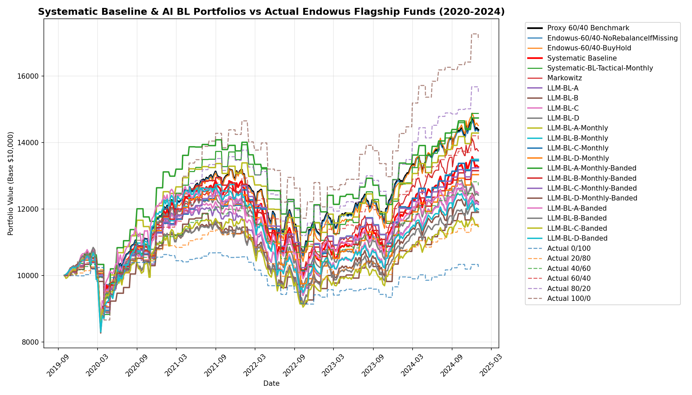
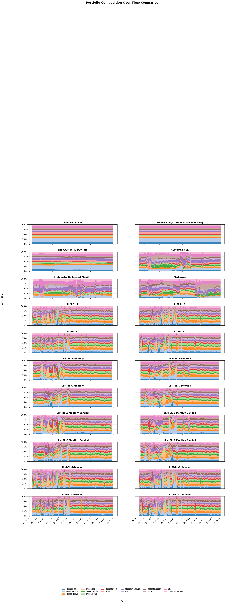
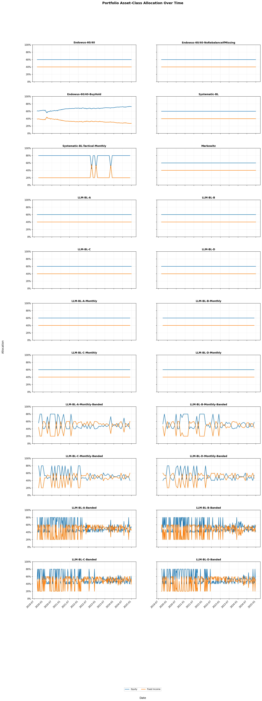
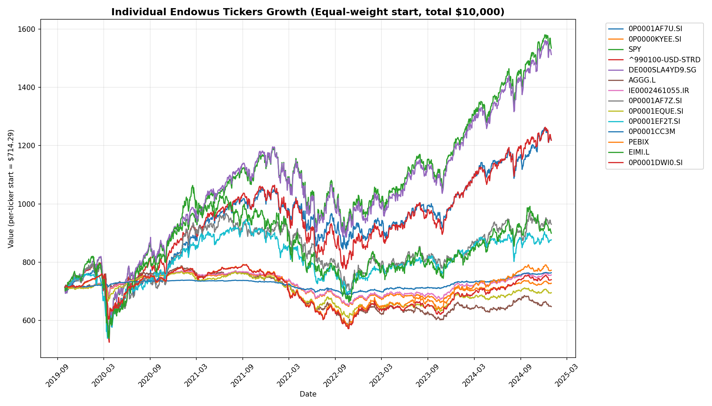

# Systematic BL Full-Period Backtest Report

This report summarizes the full backtest-period performance of the Systematic BL suite and related benchmarks.

## Backtest Window (2019-09-30 to 2024-12-31)

### Equity Curve Comparison

### Portfolio Composition Comparison

### Equity vs Fixed Income Allocation

### Underlying Ticker Growth

### Performance Metrics (Full Period)

| Strategy                           | Ann. Return   |   Sharpe Ratio | Max Drawdown   |   Calmar Ratio | CAPM Alpha (Ann)   | FF3 Alpha (Ann)   | FF5 Alpha (Ann)   |
|:-----------------------------------|:--------------|---------------:|:---------------|---------------:|:-------------------|:------------------|:------------------|
| Endowus-60/40                      | 7.16%         |          0.451 | -21.53%        |          0.333 | -2.65%             | -2.56%            | -2.85%            |
| Endowus-60/40-NoRebalanceIfMissing | 7.10%         |          0.446 | -21.53%        |          0.33  | -2.71%             | -2.61%            | -2.91%            |
| Endowus-60/40-BuyHold              | 7.34%         |          0.444 | -22.29%        |          0.329 | -2.97%             | -2.89%            | -3.10%            |
| Systematic-BL                      | 5.52%         |          0.307 | -22.34%        |          0.247 | -4.56%             | -4.47%            | -4.72%            |
| Systematic-BL-Tactical-Monthly     | 7.98%         |          0.454 | -22.06%        |          0.362 | -4.62%             | -4.56%            | -4.88%            |
| Markowitz                          | 6.25%         |          0.368 | -22.19%        |          0.282 | -3.77%             | -3.71%            | -3.92%            |
| LLM-BL-A                           | 3.75%         |          0.172 | -22.17%        |          0.169 | -5.41%             | -5.25%            | -5.50%            |
| LLM-BL-B                           | 3.87%         |          0.181 | -22.78%        |          0.17  | -5.54%             | -5.38%            | -5.59%            |
| LLM-BL-C                           | 4.30%         |          0.218 | -22.94%        |          0.188 | -5.10%             | -4.99%            | -5.27%            |
| LLM-BL-D                           | 4.21%         |          0.21  | -22.22%        |          0.189 | -5.17%             | -5.07%            | -5.35%            |
| LLM-BL-A-Monthly                   | 7.14%         |          0.439 | -20.10%        |          0.355 | -3.21%             | -3.08%            | -4.41%            |
| LLM-BL-B-Monthly                   | 5.97%         |          0.363 | -20.38%        |          0.293 | -4.55%             | -4.42%            | -4.89%            |
| LLM-BL-C-Monthly                   | 5.90%         |          0.358 | -19.38%        |          0.305 | -4.27%             | -4.15%            | -5.27%            |
| LLM-BL-D-Monthly                   | 5.26%         |          0.307 | -22.15%        |          0.237 | -5.13%             | -4.97%            | -5.73%            |
| LLM-BL-A-Monthly-Banded            | 7.79%         |          0.514 | -19.76%        |          0.394 | -1.84%             | -1.73%            | -3.09%            |
| LLM-BL-B-Monthly-Banded            | 5.44%         |          0.326 | -21.46%        |          0.254 | -4.75%             | -4.61%            | -5.01%            |
| LLM-BL-C-Monthly-Banded            | 5.57%         |          0.332 | -19.39%        |          0.287 | -4.26%             | -4.06%            | -5.01%            |
| LLM-BL-D-Monthly-Banded            | 3.42%         |          0.15  | -22.96%        |          0.149 | -6.42%             | -6.30%            | -7.60%            |
| LLM-BL-A-Banded                    | 3.81%         |          0.178 | -21.90%        |          0.174 | -5.05%             | -4.88%            | -5.30%            |
| LLM-BL-B-Banded                    | 3.40%         |          0.142 | -21.83%        |          0.156 | -5.54%             | -5.33%            | -5.77%            |
| LLM-BL-C-Banded                    | 2.66%         |          0.078 | -22.75%        |          0.117 | -6.26%             | -6.14%            | -6.45%            |
| LLM-BL-D-Banded                    | 3.51%         |          0.153 | -25.51%        |          0.138 | -5.31%             | -5.11%            | -5.66%            |
| Endowus_Actual_0/100               | 0.48%         |         -0.321 | -14.46%        |          0.033 | -4.71%             | -4.78%            | -4.92%            |
| Endowus_Actual_20/80               | 2.61%         |          0.062 | -15.01%        |          0.174 | -4.03%             | -4.04%            | -4.29%            |
| Endowus_Actual_40/60               | 4.67%         |          0.304 | -16.01%        |          0.292 | -3.38%             | -3.34%            | -3.67%            |
| Endowus_Actual_60/40               | 6.72%         |          0.455 | -17.40%        |          0.386 | -2.76%             | -2.66%            | -3.06%            |
| Endowus_Actual_80/20               | 8.73%         |          0.556 | -18.67%        |          0.468 | -2.06%             | -1.90%            | -2.44%            |
| Endowus_Actual_100/0               | 10.74%        |          0.628 | -20.00%        |          0.537 | -1.38%             | -1.17%            | -1.78%            |

---

Generated by `systematic_bl_baseline.py`.
