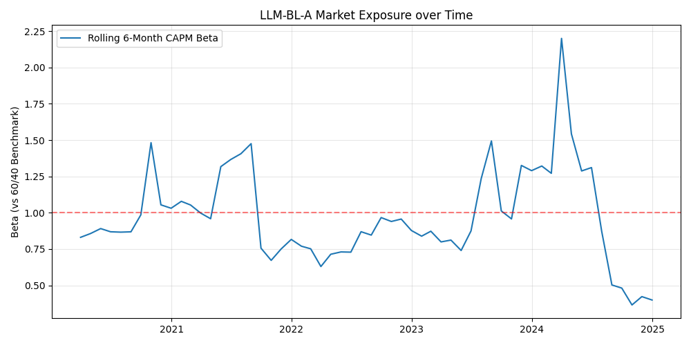
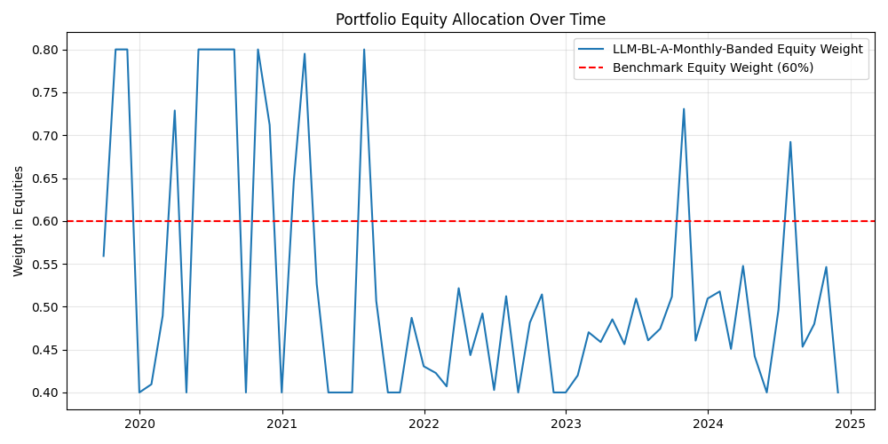
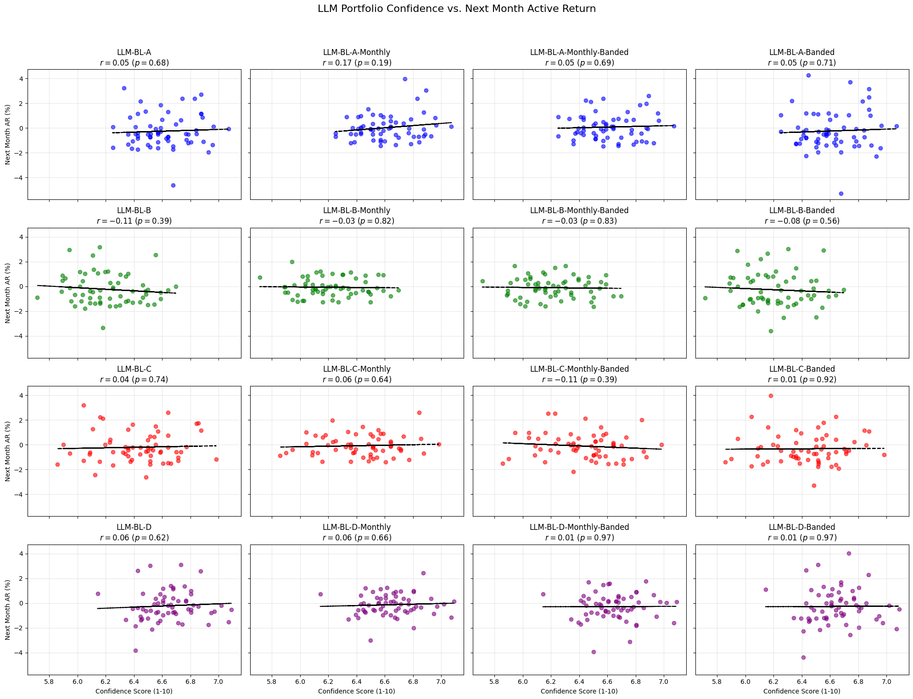

# Thesis Quantitative Analyses Report

## 1. Turnover & Transaction Cost Sensitivity
- **Average Weekly Turnover**: 20.99%
- **Average Monthly Turnover**: 21.77%

| Transaction Cost | LLM Weekly Ann. Ret | LLM Monthly Ann. Ret |
|------------------|----------------------|-----------------------|
| 0 bps (Frictionless) | 3.75% | 7.02% |
| 5 bps | 3.20% | 6.89% |
| 10 bps | 2.66% | 6.76% |
| 20 bps | 1.57% | 6.50% |

## 2. Rolling Beta / Factor Exposure Analysis
- **Average Rolling Beta**: 0.97
- **Minimum Beta**: 0.36
- **Maximum Beta**: 2.20

## 3. Regime-Conditioned Statistical Testing (Crisis Alpha)
| Regime | N Months | Hit Rate | Mean Active Return | Binomial p-val | Newey-West p-val |
|--------|----------|----------|--------------------|----------------|------------------|
| High Vol (VIX > 22) | 23 | 56.5% | 0.25% | 0.3388 | 0.3498 |
| Normal (VIX <= 22) | 40 | 45.0% | -0.02% | 0.7852 | 0.9212 |

## 4. Brinson-Fachler Attribution (Asset Allocation vs. Selection)
- **Total Cumulative Active Return**: 4.20%
  - **Contribution from Inter-Class Allocation (Eq vs FI)**: -1.94%
  - **Contribution from Intra-Class Selection**: 6.14%

## 5. Conviction vs. Accuracy (The $\Omega$ Matrix Analysis)
This analysis compares the LLM's average portfolio confidence score against the realized active return in the *following* month, across all models and variations.

| Portfolio | Pearson r | p-val | Spearman $\rho$ | p-val |
|-----------|-----------|-------|------------------|-------|
| LLM-BL-A | 0.053 | 0.6848 | 0.067 | 0.6064 |
| LLM-BL-A-Monthly | 0.168 | 0.1927 | 0.085 | 0.5125 |
| LLM-BL-A-Monthly-Banded | 0.051 | 0.6948 | 0.009 | 0.9465 |
| LLM-BL-A-Banded | 0.048 | 0.7120 | 0.041 | 0.7502 |
| LLM-BL-B | -0.112 | 0.3882 | -0.120 | 0.3515 |
| LLM-BL-B-Monthly | -0.029 | 0.8209 | -0.028 | 0.8306 |
| LLM-BL-B-Monthly-Banded | -0.029 | 0.8258 | -0.013 | 0.9178 |
| LLM-BL-B-Banded | -0.076 | 0.5592 | -0.073 | 0.5731 |
| LLM-BL-C | 0.042 | 0.7433 | 0.057 | 0.6627 |
| LLM-BL-C-Monthly | 0.060 | 0.6429 | 0.013 | 0.9184 |
| LLM-BL-C-Monthly-Banded | -0.112 | 0.3860 | -0.162 | 0.2077 |
| LLM-BL-C-Banded | 0.013 | 0.9194 | 0.074 | 0.5658 |
| LLM-BL-D | 0.065 | 0.6168 | 0.122 | 0.3456 |
| LLM-BL-D-Monthly | 0.058 | 0.6551 | 0.076 | 0.5548 |
| LLM-BL-D-Monthly-Banded | 0.005 | 0.9662 | 0.019 | 0.8838 |
| LLM-BL-D-Banded | 0.005 | 0.9669 | 0.066 | 0.6090 |
| **OVERALL (All)** | **0.010** | **0.7600** | **0.018** | **0.5609** |

