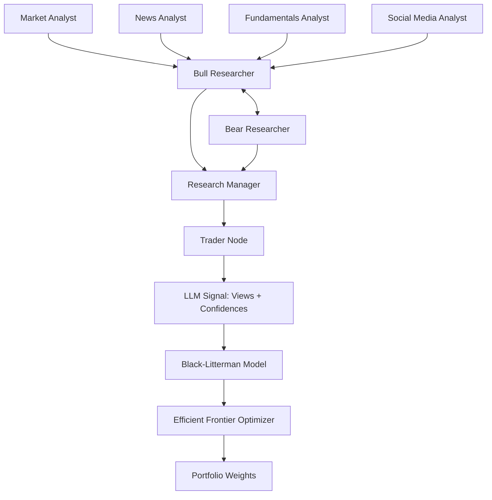

# Results Analysis & Thesis Plan: LLMs and Multi-Agent Communication for Portfolio Allocation

## 1. Project Overview

You adapted the [TradingAgents](https://arxiv.org/abs/2412.20138) framework — originally designed for single-stock buy/sell/hold decisions — into a **multi-asset portfolio allocation** system. Instead of trading individual equities, your system generates views on 14 instruments from the **Endowus Flagship 60/40 Fund** and feeds them into a **Black-Litterman optimizer** to produce portfolio weights.

### System Architecture

### Key Adaptations from Original Paper
| Aspect | Original TradingAgents | Your Adaptation |
|--------|----------------------|-----------------|
| **Decision** | Buy/Sell/Hold single stock | Return views + confidences for 14 instruments |
| **Optimization** | None (direct action) | Black-Litterman → Efficient Frontier |
| **Universe** | Single ticker | 14 fund instruments (Endowus Flagship) |
| **Benchmark** | Stock returns | Static 60/40, Markowitz, actual Endowus allocations |
| **Risk Mgmt** | Agent-level debate | Skipped in favor of BL constraints + 60/40 banding |
| **LLM** | GPT-4o / o1-preview | GLM-4-32B (via OpenRouter) |

---

## 2. Results Analysis

### 2.1 Full-Period Performance (2019-09 to 2024-12)

#### Key Rankings by Sharpe Ratio

| Rank | Strategy | Ann. Return | Sharpe | Max DD | Calmar |
|------|----------|-------------|--------|--------|--------|
| 1 | Endowus_Actual_100/0 | 10.74% | 0.628 | -20.00% | 0.537 |
| 2 | Endowus_Actual_80/20 | 8.73% | 0.556 | -18.67% | 0.468 |
| 3 | **LLM-BL-A-Monthly-Banded** | **7.79%** | **0.514** | **-19.76%** | **0.394** |
| 4 | Endowus_Actual_60/40 | 6.72% | 0.455 | -17.40% | 0.386 |
| 5 | Systematic-BL-Tactical-Monthly | 7.98% | 0.454 | -22.06% | 0.362 |
| 6 | Endowus-60/40 | 7.16% | 0.451 | -21.53% | 0.333 |
| 7 | LLM-BL-A-Monthly | 7.14% | 0.439 | -20.10% | 0.355 |

> [!IMPORTANT]
> **LLM-BL-A-Monthly-Banded** is the best-performing LLM strategy (Sharpe 0.514) and outperforms the Endowus-60/40 benchmark (0.451). It also beats the actual Endowus 60/40 allocation (0.455) marginally, while achieving a *lower max drawdown* (-19.76% vs -21.53%).

#### Key Observations

1. **Monthly rebalancing dominates weekly**: All "Monthly" variants outperform their weekly counterparts significantly. Weekly LLM-BL-A returns only 3.75% (Sharpe 0.172) vs. LLM-BL-A-Monthly at 7.14% (Sharpe 0.439). This suggests LLM views are **noisy at high frequency** and benefit from temporal aggregation.

2. **Banding helps the best variant but hurts others**: Adding turnover bands to LLM-BL-A-Monthly *improves* it (0.439 → 0.514), but damages LLM-BL-D-Monthly (0.307 → 0.150). This indicates that constraining turnover helps when the LLM has a strong alpha signal, but hurts when the signal is already weak.

3. **Variation A (Fundamentals + Market) is the clear winner**: Across all configurations, Variation A consistently outperforms B (News), C (Technicals), and D (Full Debate). This strongly suggests that macroeconomic fundamentals + price data produce the most useful views for the BL model.

4. **Full Debate (D) does not improve on simpler variants**: Despite having the most information, Variation D generally underperforms A. This is a key finding — more agent communication does not necessarily produce better outcomes. Information overload or conflicting signals dilute the view quality.

5. **All LLM strategies have negative alpha**: CAPM, FF3, and FF5 alphas are universally negative (roughly -1.7% to -7.6% annualized). This means the strategies don't generate true excess returns over factor exposures — their returns are largely explained by market beta and style tilts.

6. **Drawdowns are similar across strategies**: Max drawdowns cluster around -19% to -23%, suggesting that the BL optimizer with 60/40 class constraints produces relatively consistent risk profiles regardless of view source.

### 2.2 Event Study Highlights

| Event | Best LLM Strategy | LLM Return | Endowus-60/40 | Winner |
|-------|-------------------|------------|----------------|--------|
| COVID Crash & Rebound | LLM-BL-A-Monthly-Banded | 9.47% | 2.74% | **LLM** ✅ |
| EM Divergence | LLM-BL-C-Monthly-Banded | -7.33% | -8.38% | **LLM** ✅ |
| Inflation Shock | LLM-BL-C-Monthly-Banded | -11.89% | -14.47% | **LLM** ✅ |
| Russia-Ukraine | LLM-BL-A-Banded | -15.32% | -15.87% | ~Tie |
| BOJ Surprise | LLM-BL-A-Monthly | 5.07% | 5.06% | ~Tie |
| Regional Banking | LLM-BL-B-Monthly-Banded | 0.98% | 2.79% | Endowus ❌ |

> [!TIP]
> The LLM strategies show their **greatest advantage during abrupt exogenous shocks** (COVID, EM divergence, inflation). During these events, the LLM Monthly-Banded variants offer meaningful downside protection. However, in more gradual, domestically-contained events (regional banking), the static benchmark performs better.

### 2.3 Hyperparameter Sensitivity

The grid search over optimizer settings reveals:
- **`max-quadratic-utility` generally beats `max-sharpe`** for LLM-BL strategies (especially with higher L2 regularization γ=0.9–1.0)
- Higher L2 regularization **dampens extreme weights**, which is especially important for noisy LLM-generated views
- Risk aversion has minimal impact within the tested range (1–5), suggesting BL posterior dominates the output
- The best tuned LLM-BL-A reaches Sharpe 0.361 (vs. default 0.172), demonstrating **meaningful hyperparameter sensitivity**

---

## 3. Thesis Structure Proposal

### Title Suggestions
1. *"Multi-Agent LLM Systems for Strategic Asset Allocation: Integrating Black-Litterman with Autonomous Market Analysis"*
2. *"From Stock Trading to Portfolio Construction: Evaluating Multi-Agent LLM Communication for Black-Litterman View Generation"*
3. *"Can AI Agents Replace Human Analysts? A Multi-Agent Framework for Automated Portfolio Allocation"*

### Proposed Chapter Outline

#### Chapter 1: Introduction
- Motivation: Why use LLMs for portfolio construction?
- Research gap: TradingAgents only covers single-stock decisions → no work on multi-asset BL view generation
- Research questions:
  1. Can LLM-generated views improve Black-Litterman portfolio allocation over passive benchmarks?
  2. What is the optimal information mix (fundamentals, news, technicals, full debate) for LLM-based view generation?
  3. How does rebalancing frequency affect the value of LLM-generated signals?
  4. How do multi-agent LLM portfolios perform during market stress events?
- Contributions overview

#### Chapter 2: Literature Review
- Black-Litterman model and extensions
- LLMs in finance (sentiment analysis, return prediction, agent-based reasoning)
- Multi-agent systems / LanGraph-style orchestration
- The original TradingAgents paper (Xiao et al., 2024)
- Robo-advisory and automated portfolio construction (Endowus as case study)

#### Chapter 3: Methodology
- **3.1** System architecture (agent graph, analyst → researcher → trader pipeline)
- **3.2** Information channels: A (macro/fundamentals + market), B (news), C (technicals), D (full debate)
- **3.3** Black-Litterman integration: how LLM output maps to views and confidences
- **3.4** Portfolio construction: efficient frontier optimization, 60/40 class constraints, turnover banding
- **3.5** Backtesting framework: weekly/monthly rebalancing, transaction costs, execution prices
- **3.6** Evaluation metrics: Sharpe, Calmar, CAPM/FF3/FF5 alpha, event study methodology

#### Chapter 4: Data & Experimental Setup
- **4.1** Endowus Flagship 60/40 Fund: instrument universe (14 funds), benchmark weights
- **4.2** Price data: Yahoo Finance, backtest window (2019-09 to 2024-12)
- **4.3** LLM: GLM-4-32B via OpenRouter, 16 workers with retry logic
- **4.4** 24 strategy variants (4 ablations × {weekly, monthly, banded, monthly-banded} + benchmarks)
- **4.5** Hyperparameter grid: optimizer × risk aversion × L2 regularization (36 configs)

#### Chapter 5: Results & Discussion
- **5.1** Full-period performance comparison (headline table)
- **5.2** Ablation analysis: Which information channels matter?
  - Key finding: Fundamentals+Market (A) >> News (B) ≈ Technicals (C) > Full Debate (D)
- **5.3** Rebalancing frequency (weekly vs monthly)
  - Key finding: Monthly is strictly better → LLM views are noisy at high frequency
- **5.4** Turnover banding and its asymmetric effects
- **5.5** Factor exposure analysis (why alpha is negative)
- **5.6** Event studies: crisis-period behavior
  - Key finding: LLM strategies provide downside protection during exogenous shocks
- **5.7** Hyperparameter sensitivity: optimizer method and regularization
- **5.8** Cost of complexity: diminishing returns from more agents/debate

#### Chapter 6: Limitations & Future Work
- **Limitations:**
  - Negative alpha across all strategies → no true excess returns
  - Single LLM model (GLM-4-32B) — sensitivity to model choice unknown
  - Look-ahead bias risks in news/sentiment data
  - No out-of-sample validation (full period used for analysis)
  - Risk management debate stage was skipped
- **Future work:**
  - Test with GPT-4o, Claude, Gemini for model comparison
  - Implement adaptive rebalancing (react to volatility regimes)
  - Re-enable risk management debate and measure impact
  - Expand to multi-geography and alternatives
  - Online learning / reflection-based memory (already partially implemented)

#### Chapter 7: Conclusion
- Summary of findings
- Practical implications for robo-advisory
- Broader implications for LLMs in quantitative finance

---

## 4. Recommended Thesis Narrative Angles

### Angle 1: "Less is More"
Your strongest finding is that **simpler agent configurations outperform complex ones**. Variation A (2 analyst types) beats Variation D (full debate with 3 types). Monthly rebalancing beats weekly. This is a compelling narrative about the dangers of information overload in automated systems.

### Angle 2: "The Signal-to-Noise Challenge"
LLM views are valuable but noisy. The key engineering challenge is managing this noise through:
- Temporal smoothing (monthly vs weekly)
- Turnover constraints (banding)
- Regularization (L2 gamma)
- Information filtering (choosing the right agent subset)

### Angle 3: "Crisis Alpha"
While LLM strategies don't generate alpha over the full period, they show meaningful protective value during market stress. This positions them as a **tactical overlay** rather than a replacement for passive allocation.

---

## 5. Additional Analysis Ideas

To strengthen the thesis, consider these additional experiments (which I can help implement):

1. **Weight stability analysis**: Plot raw weight timeseries to show how different rebalancing frequencies affect turnover (data exists in `weights_raw/`)
2. **View accuracy study**: Compare LLM-generated return views vs. actual realized returns to measure forecast skill
3. **Rolling Sharpe analysis**: Show time-varying alpha/risk-adjusted performance across market regimes
4. **Conviction analysis**: Study whether higher-confidence views generate better allocation outcomes
5. **Agent communication transcript analysis**: Sample and analyze the bull/bear debate logs to show qualitative reasoning patterns (data in `eval_results/`)
6. **Cost sensitivity**: Vary transaction costs to find the breakeven point where LLM strategies dominate

> [!NOTE]
> All the raw data needed for these additional analyses already exists in your project — the `weights_raw/`, [diagnostics/](file:///Users/ivanlee/Developer/TradingAgents/endowus_portfolio_engine.py#137-149), and `eval_results/` directories contain the necessary inputs.
